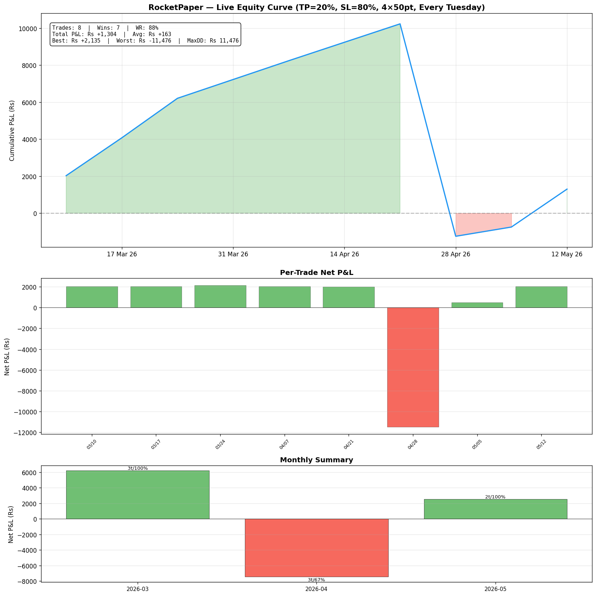

# RocketPaper — Nifty 0-DTE Credit Spread Paper Trader

Automated paper trading bot for a **Nifty 0-DTE credit spread** strategy, running fully unattended on GitHub Actions every Tuesday (Nifty weekly expiry day).

---

## Strategy

| Parameter | Value |
|-----------|-------|
| Signal | DAX opening gap direction (no threshold — trade every Tuesday) |
| Direction | Gap up → sell PE spread; Gap down → sell CE spread |
| Spread | 4-wide (200pt), ATM |
| Take Profit | 20% of max risk |
| Stop Loss | 80% of max risk |
| Entry | ~13:35 IST |
| Exit | ~15:15 IST (expiry close) |
| Monitoring | Every 5 min, TP/SL checked continuously |
| Lot size | 65 |

**Backtest (real 1-min Nifty data, 21 months, 88 trades):**
- **87.5% win rate** — 77 wins, 11 losses, 0 SL hits
- **Rs +123,266 total profit** — Rs +1,400 avg per trade
- **Max drawdown: Rs 5,292** — single bad trade

---

## Live Dashboard

> Updated automatically after every trade.



---

## How It Works

```
Every Tuesday at 08:00 UTC (13:30 IST):
  GitHub Actions starts a single long-running job (~105 min)

  13:35 IST → ENTRY
    ├─ Get DAX opening gap direction
    ├─ Fetch Nifty LTP + option chain from Angel One
    ├─ Build credit spread, log entry
    │
  13:40–15:10 IST → MONITOR (every 5 min)
    ├─ Fetch live option prices
    ├─ Check TP (20%) → exit immediately if hit
    ├─ Check SL (80%) → exit immediately if hit
    │
  15:15 IST → TIME EXIT (if neither TP/SL hit)
    ├─ Calculate final P&L with real costs
    ├─ Update paper_trades.csv
    ├─ Regenerate dashboard PNG
    └─ Commit all results to repo
```

---

## Files

| File | Purpose |
|------|---------|
| `paper_trader.py` | Main bot (run/test/summary/dashboard) |
| `rocket_backtest.py` | Historical backtest engine (reference) |
| `paper_trades.csv` | All trade logs (auto-updated) |
| `paper_dashboard.png` | Visual dashboard (auto-updated) |
| `.github/workflows/trade.yml` | GitHub Actions cron schedule |

---

## Setup

1. **Fork/create** this repo (private recommended)
2. **Add GitHub Secrets** (Settings → Secrets → Actions):
   - `ANGEL_API_KEY`
   - `ANGEL_CLIENT_ID`
   - `ANGEL_MPIN`
   - `ANGEL_TOTP_SECRET`
   - `TELEGRAM_BOT_TOKEN`
   - `TELEGRAM_CHAT_ID`
3. **Enable Actions** (Actions tab → enable workflows)
4. **Manual test**: Actions → "RocketPaper" → Run workflow → select `test`

The bot runs automatically every Tuesday. Results appear in the dashboard image above.

---

## Local Usage

```bash
pip install -r requirements.txt

# Set credentials
export ANGEL_API_KEY=your_key
export ANGEL_CLIENT_ID=your_id
export ANGEL_MPIN=your_pin
export ANGEL_TOTP_SECRET=your_totp

# Commands
python paper_trader.py test        # dry run — check prices, no trade
python paper_trader.py run         # full run — entry → monitor → exit
python paper_trader.py summary     # print trade stats
python paper_trader.py dashboard   # regenerate chart
```
