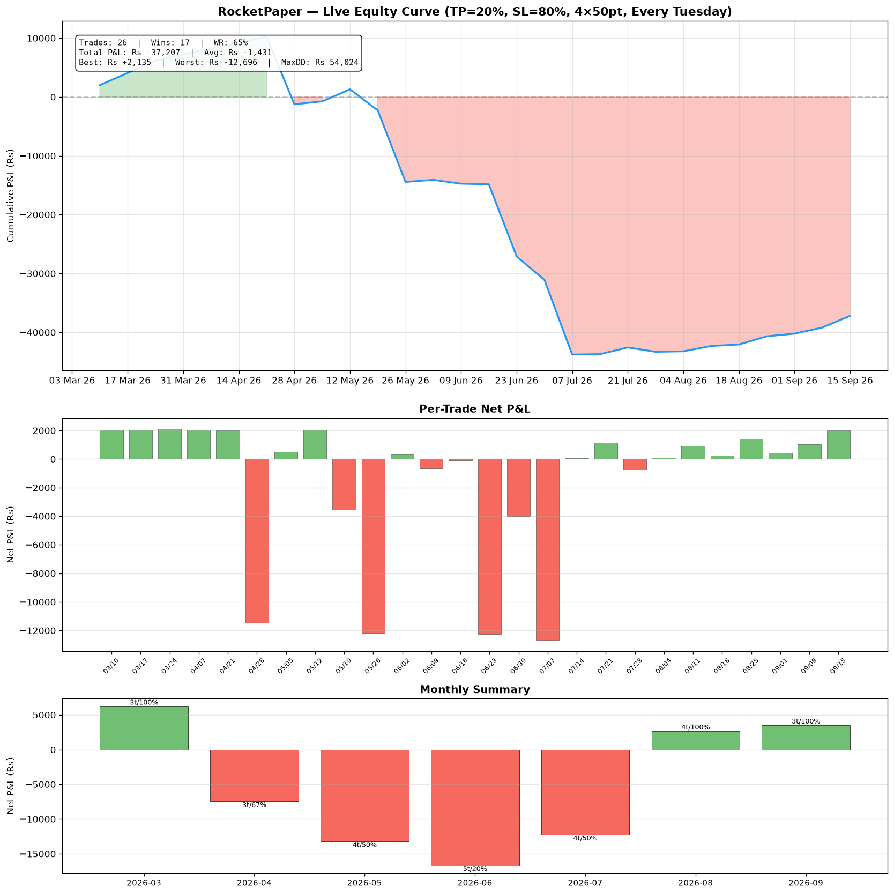

# RocketPaper

Automated Nifty 0-DTE credit spread paper trader. Runs every Tuesday on GitHub Actions — fully unattended.

---

<!-- STATS_START -->
| Trades | Win Rate | Total P&L | Avg P&L | Max DD | Streak |
|:------:|:--------:|:---------:|:-------:|:------:|:------:|
| 26 | 65% (17W/9L) | Rs -37,207 | Rs -1,431 | Rs 54,024 | 7W |
<!-- STATS_END -->

---

## Live Dashboard

---

## Last Trade

<!-- LAST_TRADE_START -->
| Field | Value |
|-------|-------|
| Date | 2026-09-15 (Tuesday) |
| Direction | Bearish |
| Spread | CE 23250/23450 (4-wide) |
| Credit | Rs 3,143 |
| Risk | Rs 9,857 |
| Exit | TP at 14:47 |
| Nifty | 23267 -> 23170 |
| Result | **W Rs +1,993 (+20.2%)** |
<!-- LAST_TRADE_END -->

---

## Commands

Trigger via **Actions → RocketPaper → Run workflow** — results sent to Telegram.

| Command | What it does |
|---------|-------------|
| `run` | Full trade cycle (auto every Tuesday) |
| `test` | Dry run — check prices, no trade |
| `status` | Current trade status or next trade time |
| `lasttrade` | Last trade details → Telegram |
| `portfolio` | Overall P&L summary → Telegram |
| `alltrades` | All trades table → Telegram |
| `dashboard` | Regenerate dashboard PNG |
